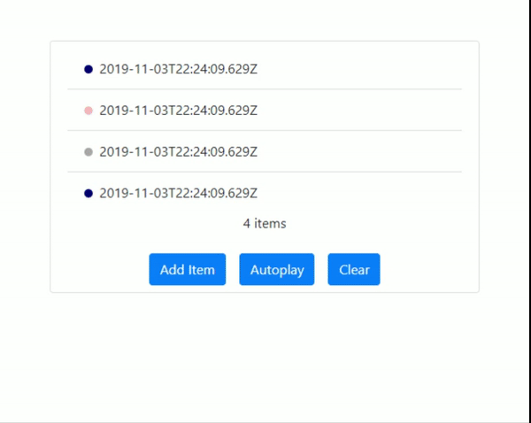

<h1 align="center" style="border-bottom: none;">react-scrollable-feed</h1>
<h3 align="center">Smart scrolling for chat UIs and feeds</h3>
<p align="center">
  <a href="https://github.com/dizco/react-scrollable-feed/actions/workflows/main.yml">
    
  </a>
  <a href="https://dashboard.cypress.io/#/projects/eyny7g">
    
  </a>
  <a href="https://www.npmjs.com/package/react-scrollable-feed">
    
  </a>
  <a href="http://makeapullrequest.com">
    
  </a>
</p>

UX-wise, asking a user to scroll down manually a chat box when new messages arrive is quite painful. **react-scrollable-feed** aims to alleviate the burden of managing scrolling concerns from React developers. The same concept applies to any other kind of feed where new content arrives dynamically.

## Demo

View a live demo [here](https://dizco.github.io/react-scrollable-feed/).



## Install

```bash
npm install --save react-scrollable-feed
```

## Usage

```tsx
import * as React from 'react'

import ScrollableFeed from 'react-scrollable-feed'

class App extends React.Component {
  render() {
    const items = ['Item 1', 'Item 2'];

    return (
      <ScrollableFeed>
        {items.map((item, i) => <div key={i}>{item}</div>)}
      </ScrollableFeed>
    );
  }
}
```

## Options

### forceScroll

- Type: `boolean`
- Default: `false`

If set to true, will scroll to the bottom after each update on the component. By default, if the scrollable section is not at the bottom _before_ the update occurs, it will leave the scroll at the same position.

### animateScroll

- Type: `(element: HTMLElement, offset: number) => void`
- Default:
```ts
if (element.scrollBy) {
  element.scrollBy({ top: offset });
}
else {
  element.scrollTop = offset;
}
```

Allows to override the scroll animation by any implementation.

### onScrollComplete

- Type: `() => void`
- Default: `() => {}`

Is called after the scroll animation has been executed.

### changeDetectionFilter

- Type: `(previousProps: ScrollableFeedComponentProps, newProps: ScrollableFeedComponentProps) => boolean`
- Default: `() => true`

Allows to customize _when_ the scroll should occur. This will be called everytime a `componentDidUpdate` happens, which means everytime one of the props changes. You will receive as parameters the previous and the new props.

Note: `ScrollableFeedComponentProps` is defined as `React.PropsWithChildren<ScrollableFeedProps>`

If you want to compare the last children from both the previous and new props, you could do something like this :

```tsx
import * as React from 'react'

import ScrollableFeed from 'react-scrollable-feed'

class App extends React.Component {
  changeDetectionFilter(previousProps, newProps) {
    const prevChildren = previousProps.children;
    const newChildren = newProps.children;

    return prevChildren !== newChildren
      && prevChildren[prevChildren.length - 1] !== newChildren[newChildren.length - 1];
  }

  render() {
    const items = ['Item 1', 'Item 2'];

    return (
      <ScrollableFeed
        changeDetectionFilter={this.changeDetectionFilter}
      >
        {items.map((item, i) => <div key={i}>{item}</div>)}
      </ScrollableFeed>
    );
  }
}

export default App;
```

### className

- Type: `string`
- Default: `undefined`

`CSS` class that can be added on the wrapping div created by `ScrollableFeed`.

### viewableDetectionEpsilon

- Type: `number`
- Default: `2`

Indicates the number of pixels of difference between the actual bottom and the current position that can be tolerated. The default setting should be fine for most use cases.

### onScroll

- Type: `(isAtBottom: boolean) => void`
- Default: `() => {}`

Is called when the `onScroll` event is triggered on the wrapper div created by `ScrollableFeed`.

Provides `isAtBottom` boolean value as a parameter, which indicates if the scroll is at bottom position, taking `viewableDetectionEpsilon` into account.

## Public Methods

### scrollToBottom

- Signature: `() => void`

Scroll to the bottom

## For more details

For more details on how to integrate _react-scrollable-feed_ in your application, have a look at the [example](example) folder.

## Contibuting
- Star this GitHub repo :star:
- Create pull requests, submit bugs, suggest new features or documentation updates :wrench:. See [contributing doc](CONTRIBUTING.md).

## License

BSD 3-Clause © [Gabriel Bourgault](https://github.com/dizco)

See [license](LICENSE).
